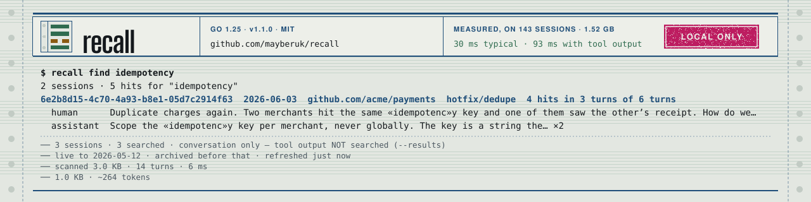

<!-- Banner slot: drop a 1280×320 SVG/PNG at docs/assets/banner.svg and replace this comment with
     <p align="center"></p> -->

# recall

**Search every past coding-agent session on your machine — from any checkout, in milliseconds.**

[](https://github.com/mayberuk/recall/actions/workflows/ci.yml)
[](https://github.com/mayberuk/recall/releases/latest)
[](go.mod)
[](docs/mcp.md)
[](LICENSE)

You solved this before. Two months ago, in a branch you've since deleted, in a session you can't
find. Your agent doesn't remember it, and neither do you — only that it happened.

`recall` finds it. One query reaches every session your coding agent has ever recorded on this
machine, across every checkout, clone and worktree of the repo you're standing in. No index, no
per-project setup, no daemon. Ask from a shell, or let your agent ask over MCP.

```console
$ cd ~/src/payments        # the main checkout
$ recall find idempotency
2 sessions · 5 hits for "idempotency"
6e2b8d15-4c70-4a93-b8e1-05d7c2914f63  2026-06-03  github.com/acme/payments  hotfix/dedupe  4 hits in 3 turns of 6 turns
  human      Duplicate charges again. Two merchants hit the same «idempotenc»y key and one of them saw the other's receipt. How do we scope…
  assistant  Scope the «idempotenc»y key per merchant, never globally. The key is a string the… ×2
  assistant  …a row it cannot interpret. The existing primary key is the bare «idempotenc»y_key, so the migration is: add merchant_id to the table,…
3b8a2c94-6d17-4e05-8f2b-c091d67a4e38  2026-07-21  github.com/acme/payments  main  1 hit of 4 turns
  assistant  …charge may well have succeeded — so a retry there needs the «idempotenc»y key to be safe, and without one it must not be retried at all.
── 3 sessions · 3 searched · conversation only — tool output NOT searched (--results)
── live to 2026-05-12 · archived before that · refreshed just now
── scanned 3.0 KB · 14 turns · 6 ms
── 1.0 KB · ~264 tokens
```

That answer came out of a **different checkout** — `payments-hotfix`, a branch that no longer
exists locally — found from `payments` without naming it. Every block in this README is real
output you can reproduce: `./scripts/demo.sh` builds a fixed corpus and runs them.

## Why it exists

Claude Code keys sessions by **checkout path** (`~/.claude/projects/-home-you-src-payments/…`).
One logical repository sprawls across clones, worktrees and relocations, so a search scoped to
the directory you happen to be in silently misses the answer. That is the failure this was built
for: a conclusion hunted for in one checkout that turned out to live in another checkout of the
*same* repo.

`recall` resolves a repo by its **git remote**, not its path, so every checkout is one corpus.

## Install

```sh
curl -fsSL https://raw.githubusercontent.com/mayberuk/recall/main/install.sh | sh
```

Downloads the binary for your platform, verifies it against the release's published sha256, and
installs to `~/.local/bin`. It registers recall with nothing — that is a separate, deliberate step.

<details>
<summary>Other ways in</summary>

```sh
go install github.com/mayberuk/recall/cmd/recall@latest   # needs Go 1.25+

# from a checkout
git clone https://github.com/mayberuk/recall.git && cd recall
./scripts/install-from-source.sh    # builds, verifies, installs to ~/.local/bin
```

Pin a version with `RECALL_VERSION=v1.1.0`, or change the destination with `RECALL_INSTALL_DIR`.
Pre-built binaries for Linux, macOS and Windows on amd64 and arm64 are attached to
[every release](https://github.com/mayberuk/recall/releases/latest).
</details>

`recall` is a single static binary (`CGO_ENABLED=0`) with two dependencies and no configuration.
Nothing to initialize: a directory you never set up is exactly the one you'll want to search.

## Let your agent ask

`recall` speaks the [Model Context Protocol](https://modelcontextprotocol.io) over stdio. One
command registers it and installs the skill that makes an agent actually reach for it:

```sh
recall mcp install claude-code    # or codex · gemini · copilot · cursor · opencode · windsurf
```

`recall mcp config <client>` prints the same entry and **writes nothing**, if you'd rather paste it
yourself. Five read-only tools — `recall_find`, `recall_turns`, `recall_show`, `recall_when`,
`recall_guide` — each running the CLI verb it's named after, so a tool call and a command line can
never disagree about what the corpus holds. Full client-by-client detail: **[docs/mcp.md](docs/mcp.md)**.

<details>
<summary>Or have your coding agent install it for you</summary>

Paste this to any agent with shell access:

> Install `recall`, a CLI that searches my past coding-agent sessions, by running
> `curl -fsSL https://raw.githubusercontent.com/mayberuk/recall/main/install.sh | sh`.
> Then register it with yourself by running `recall mcp install <your client>` — run
> `recall mcp config --help` to see the supported client names and pick the one that matches you.
> Finally run `recall guide` and tell me in one line what it can answer.

</details>

## What it answers

| Question | Command |
|---|---|
| Which session was that? | `recall find <query>` |
| What did we conclude, and why? | `recall turns <query>` · `recall show <session>` |
| When did this first come up? | `recall when <query>` |
| Have I hit this before, anywhere? | `recall find <query> --all` |
| Is the archive healthy? | `recall doctor` |
| Which command do I want? | `recall guide` |

Searching in the repo you're in but the answer is elsewhere? It says so, and hands you the query:

```console
$ recall turns "connection pool" --limit 1
no turns carry "connection pool" in github.com/acme/payments
found elsewhere: 5 hits in 1 other repo
  github.com/acme/infra                    5 hits · 1 session
run: recall find 'connection pool' --all
```

Place a topic in time with `recall when`:

```console
$ recall when "rate limit"
"rate limit"  first 2026-05-12 · last 2026-07-21 · 8 hits in 2 sessions
  2026-05     6 hits · 1 session
  2026-07     2 hits · 1 session
```

More worked examples, with output: **[docs/examples.md](docs/examples.md)**.

## Fast enough that an index would be a liability

Of everything Claude Code writes to disk, the actual conversation is about **3%** — 47.8 MB of a
1.52 GB session store. The rest is tool output stored twice, thinking-block signatures and
attachments. Searching that 3% is quick enough that there is nothing left for an index to win:

| Query, end to end (process start → rendered output) | 1.0.0 | now |
|---|---:|---:|
| `find` over the conversation tier | 88 ms | **30 ms** |
| `find` over every tier, tool output included | 460 ms | **93 ms** |
| a miss over every tier (the expensive path) | 549 ms | **113 ms** |

*143 sessions · 192,000 turns · AMD Ryzen 7 5700X3D.* On a seeded 50 MB corpus the search itself
is **0.34 ms** and a warm archive load **0.46 ms** — reproducible numbers, and the harness that
takes them, live in [bench/RESULTS.md](bench/RESULTS.md).

So there is no index: nothing to rebuild, nothing to go stale, no corruption class to guard
against. `docs/design.md` records the SQLite FTS5 prototype that worked and lost on those grounds.

## It tells you what it didn't search

Every searching command ends in a `──` footer naming what it left out — tier, scope, exclusions,
and what the search cost. **If the footer doesn't mention a narrowing, that narrowing didn't
happen.** Treat it as the coverage contract, not decoration.

```
── 3 sessions · 3 searched · conversation only — tool output NOT searched (--results)
── live to 2026-05-12 · archived before that · refreshed just now
── scanned 3.0 KB · 14 turns · 6 ms
── 1.0 KB · ~264 tokens
```

That last line is the one agents care about: every answer states its own size and rough token
cost, and `--budget 2000` shapes an answer down to fit. Recovering a conclusion should not cost
more context than re-deriving it.

## Agents it reads

| Agent | Session store | Status |
|---|---|---|
| Claude Code | `~/.claude/projects` | read |
| Codex CLI | `~/.codex/sessions` (`$CODEX_HOME`) | read |
| Gemini CLI, Cursor | — | detected, falls back to Claude Code and says so |

`--provider auto` (the default) detects who is asking; a name pins one; `all` searches every
registered agent at once. Naming an agent this build cannot read is refused outright rather than
answered from a corpus that isn't theirs.

Codex archives to its own tree, so adding it never rebuilds an existing Claude Code archive.

## Documentation

| | |
|---|---|
| [docs/mcp.md](docs/mcp.md) | MCP tools, every client's config path, what `install` writes |
| [docs/examples.md](docs/examples.md) | worked examples for all six commands |
| [docs/agents.md](docs/agents.md) | exit codes, `--json`, the coverage contract — written for agents |
| [docs/design.md](docs/design.md) | every decision, its measurement, and the alternatives it beat |
| [docs/requirements.md](docs/requirements.md) | the constraints that shaped it |
| [CHANGELOG.md](CHANGELOG.md) | **read before upgrading** — v1.1 rebuilds the archive |
| [AGENTS.md](AGENTS.md) | build, test and style contract for agents working *on* recall |

## License

MIT — see [LICENSE](LICENSE).
